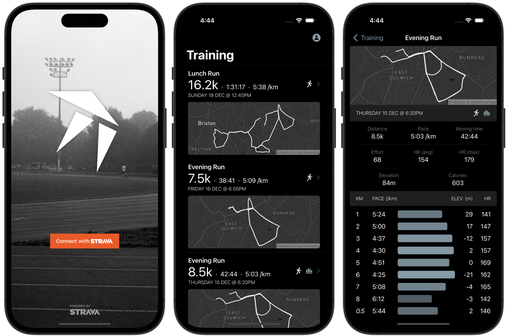

# RunLog

"Kilometer" is a work-in-progress KMM (Kotlin Multiplatform Mobile) Strava app. It calls the [Strava API](https://developers.strava.com) via `shared` Kotlin modules. The iOS and Android apps are thin UI clients (views and MVVM view models) using SwiftUI and Jetpack Compose.

## Local builds
Several API keys are required for fully functional local builds.

### Strava
Register a [Strava API application](https://strava.com/settings/api) and add your OAuth client ID and secret to `local.properties` with the keys:

- `com.jdamcd.runlog.client_id`
- `com.jdamcd.runlog.client_secret` 

### Mapbox
Create a [Mapbox](https://www.mapbox.com) account for access to the static maps API and add your token to `local.properties` with the key:

- `com.jdamcd.runlog.mapbox_token`
